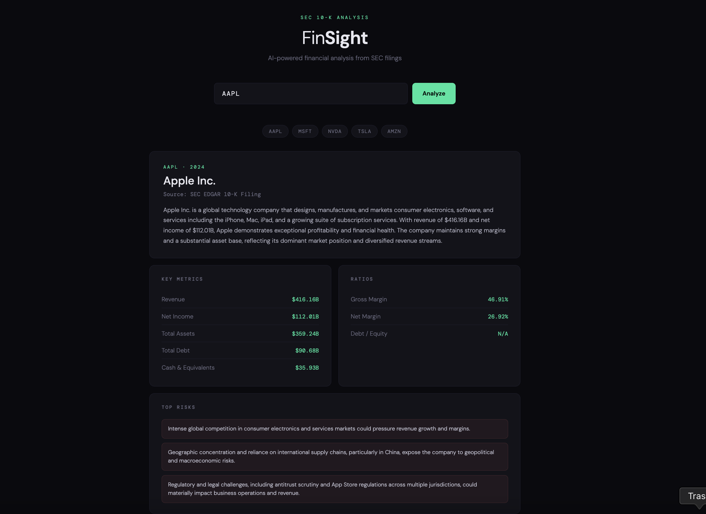

# FinSight — AI Financial Statement Analyzer

An AI-powered tool that automatically extracts and analyzes key financial metrics from SEC 10-K filings using the Anthropic Claude API and SEC EDGAR data.



## What it does

- Fetches the latest 10-K filing for any publicly traded US company using their ticker symbol
- Pulls structured financial data directly from SEC's XBRL API
- Uses Claude to generate a plain-English summary, key metrics, financial ratios, top risks, and management outlook
- Links back to the original SEC filing for verification

## Tech Stack

**Backend**
- Python / FastAPI
- Anthropic Claude API (`claude-sonnet-4-6`)
- SEC EDGAR API (company facts + XBRL data)

**Frontend**
- Vanilla HTML/CSS/JS (no build step required)

## Getting Started

### Prerequisites

- Python 3.10+
- An Anthropic API key — get one at [console.anthropic.com](https://console.anthropic.com)

### Installation

1. Clone the repo
```bash
git clone https://github.com/yourusername/finsight.git
cd finsight
```

2. Install dependencies
```bash
pip install -r requirements.txt
```

3. Set your API key
```bash
export ANTHROPIC_API_KEY=your_key_here
```

4. Start the backend
```bash
uvicorn main:app --reload
```

5. Open the frontend

Just open `frontend/index.html` in your browser — no build step needed.

## Usage

Enter any US stock ticker (e.g. `AAPL`, `MSFT`, `NVDA`) and click **Analyze**. FinSight will:

1. Look up the company's CIK number from SEC's database
2. Fetch their latest annual 10-K filing
3. Extract structured financial data via SEC's XBRL API
4. Pass the data to Claude for analysis and summarization
5. Display key metrics, ratios, risks, and outlook in a clean dashboard

## Project Structure

```
finsight/
├── main.py              # FastAPI backend
├── requirements.txt     # Python dependencies
└── frontend/
    └── index.html       # Frontend UI
```

## Example Tickers to Try

| Company | Ticker |
|---|---|
| Apple | AAPL |
| Microsoft | MSFT |
| NVIDIA | NVDA |
| Tesla | TSLA |
| Amazon | AMZN |

## Notes

- Only works with US public companies that file with the SEC
- Financial data is pulled directly from SEC EDGAR — no third-party data providers
- The XBRL API may not have data for very small or recently public companies

## License

MIT